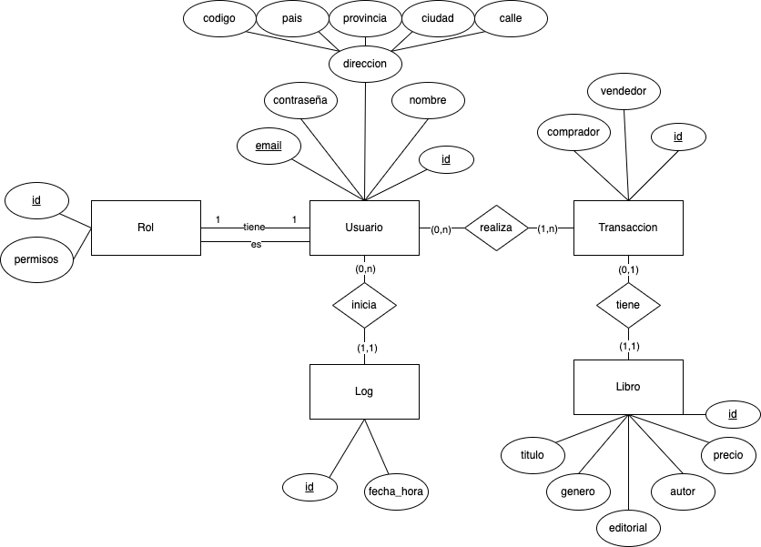
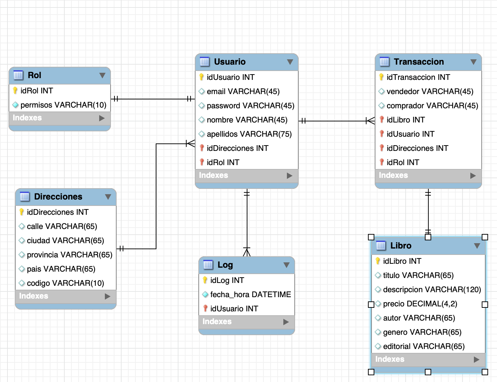

## Título
EZBOOKS - Tienda online

## Descripción
Este proyecto consiste en crear una página web de ventas de segunda mano especializada en libros a papel.

## Diagrama entidad relación


## Diagrama de clases


## Configuracion del proyecto en desarrollo
Para el modo desarrollo usamos la base de datos H2 en local junto con el almacenamiento de sesines en redis en un contenedor docker .

Nota: si al clonar este repositorio te encuentras el error de Webserlet, es que en la carpeta raiz existe un archivo con el nombre ezbooks.mv.db que corresponde a la base de datos de h2 simplemente eliminalo, al volver a ejecutar el problema habrá desaparecido.

Ahora creamos un contenedor docker para redis.
- Instala docker para escritorio
- Ejecuta el comando 
```bash
 docker run -p 9323:6379 --name redis-ezbooks -v $HOME/redis-data:/var/lib/redis -d redis:latest
```
## Configuracion del proyecto en producción
Para el modo producción usamos la base de datos MySQL junto con el almacenamiento de sesines en redis en dos contenedores de docker .

Ahora creamos un contenedor para MySQL.
- Instala docker para escritorio
- Mirar creación contenedor redis arriba
- Ejecuta el comando 
```bash
docker run -p 3306:3306 --name mysql-ezbooks -e MYSQL_ROOT_PASSWORD=secure -v $HOME/mysql-data:/var/lib/mysql -d mysql:8.0
```

## Licencia 
Privativa.
