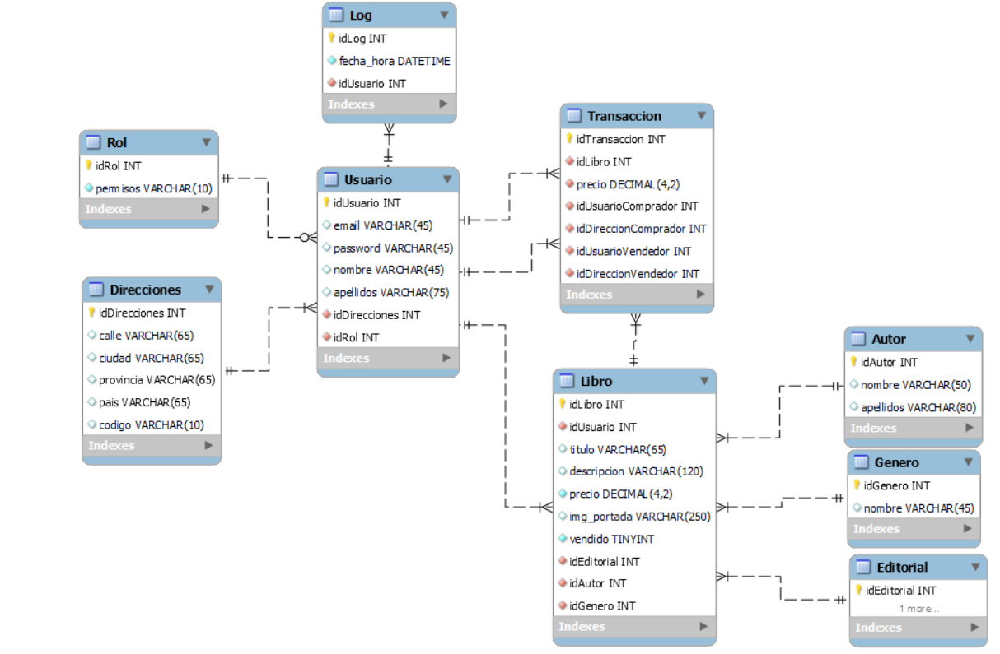

## Título
EZBOOKS - Tienda online

## Descripción
Este proyecto consiste en crear una página web de ventas de segunda mano especializada en libros a papel.

## Diagrama entidad relación

## Diagrama de clases

## Vista Previa

## Configuración
Instalar docker para escritorio y ejecutar en la terminal este commando antes de iniciar el programa.
...

## Licencia 
Privativa.
